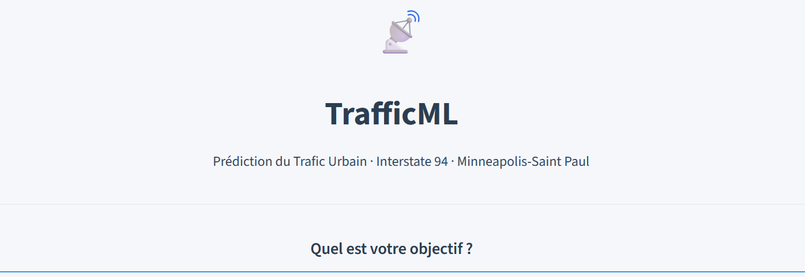
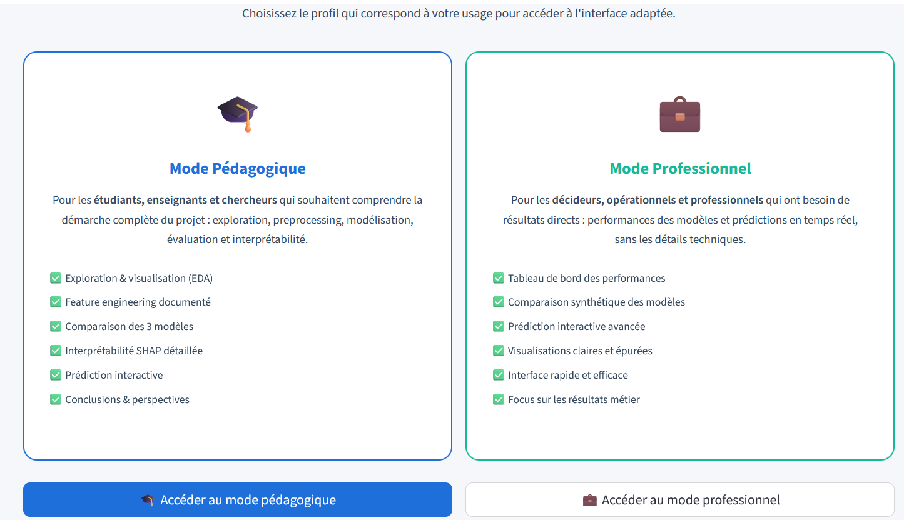
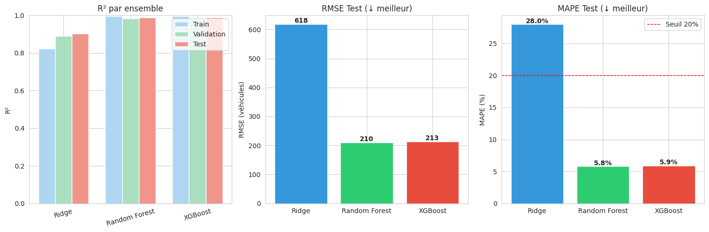
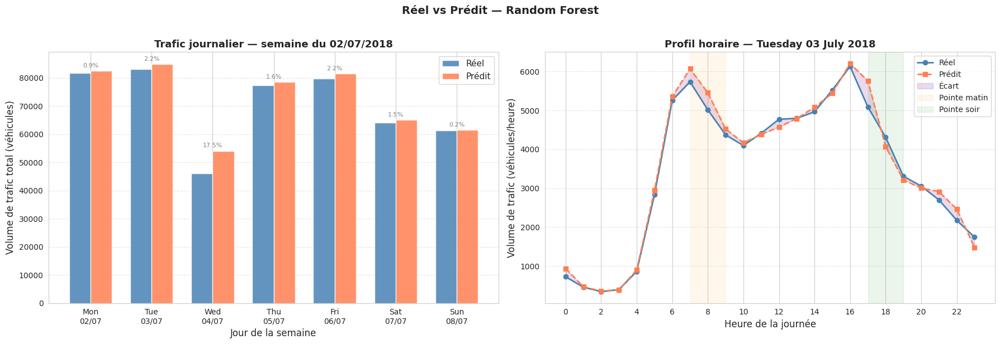
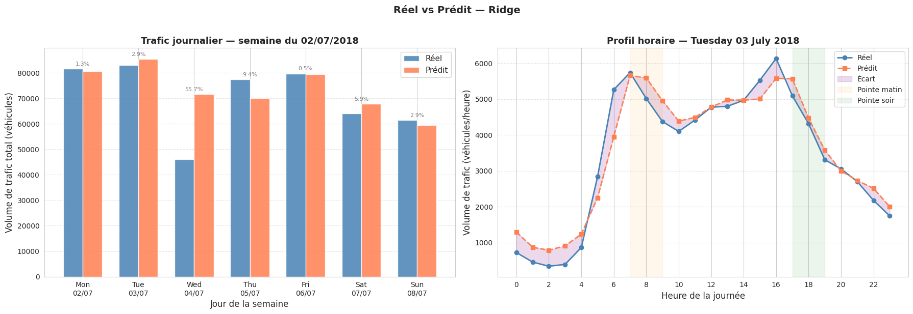
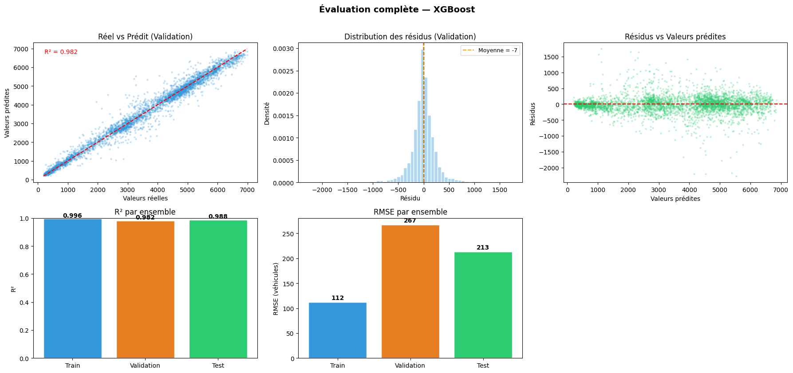
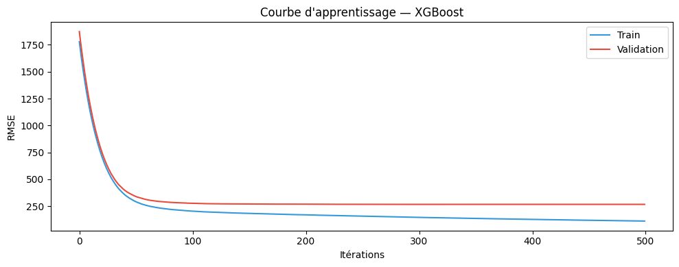

<p align="center">


</p>


<p align="center">
  <a href="README.md">
    
  </a>

  <a href="#">
    
  </a>
</p>

# Executive Summary

*This project introduces **TrafficML**, an advanced hourly traffic volume prediction solution for Interstate 94 (Minneapolis, USA). Developed as part of the Africa TechUp Tour 2025 training program, this application utilizes an optimized XGBoost model to provide robust and near real-time predictions. It demonstrates expertise in predictive modeling, feature engineering, model interpretability (SHAP), and data application deployment via Streamlit.*

### 🚀 Key Results

✔ XGBoost model explaining **98.8%** of traffic variance (R²)

✔ Mean Absolute Percentage Error (MAPE) of **5.95%**, ensuring high reliability

✔ Root Mean Squared Error (RMSE) of **213 vehicles/hour**

✔ Model **18 times lighter** than Random Forest with comparable performance

✔ Interactive Streamlit application for traffic exploration, analysis, and prediction

✔ Model interpretability through SHAP techniques

**Skills Applied:** Machine Learning, Predictive Modeling, XGBoost, Interpretability (XAI, SHAP), Streamlit, Feature Engineering, Data Application Deployment, Python, Pandas, Scikit-learn, Data Visualization.


# 📌 Background

Urban traffic management is a major challenge for modern cities, facing congestion, pollution, and wasted time. The ability to accurately predict traffic volume allows for optimizing urban planning, regulating flows, and improving road safety. Interstate 94, a vital artery connecting Minneapolis to Saint Paul, is particularly susceptible to these challenges.

This project is part of an innovation initiative to provide decision-making tools based on big data analysis and artificial intelligence, aiming to make urban infrastructures smarter and more responsive.

> 💡 **Research Question:**
> How to develop an urban traffic prediction model that is both high-performing, interpretable, and easily deployable to support urban management in near real-time?


# 🎯 Objectives

### Technical and Analytical Objectives

*   **Predictive Model Development**: Design and train Machine Learning models capable of predicting hourly traffic volume by leveraging temporal and meteorological variables.

*   **Comparative Model Evaluation**: Conduct a rigorous comparative study of several modeling approaches (Ridge Regression, Random Forest, XGBoost) to identify the most performant and efficient solution.
  
*   **Model Interpretability (XAI)**: Apply SHAP (SHapley Additive exPlanations) techniques to interpret the predictions of the chosen model, providing essential transparency on the factors influencing traffic.
  
*   **Interactive Application Deployment**: Develop an intuitive and interactive user interface via Streamlit, allowing users to explore data, simulate scenarios, and visualize predictions.


# 🗂️ Data

<table>

<tr>

<td width="35%" valign="top">

<h3 align="center">Sources</h3>

| Element | Description |
|----------|------------|
| Main Source | UCI Machine Learning Repository (ID 492) |
| Traffic Data | Metro Interstate Traffic Volume (Interstate 94) |
| Meteorological Data | OpenWeatherMap |
| Period | October 2012 to September 2018 |
| Frequency | Hourly |
| Analysis Type | Time Series, Regression |

</td>

<td width="65%" valign="top">

<h3 align="center">Selected Variables (examples)</h3>

| Variable | Description |
|-----------|------------|
| `date_time` | Date and time of observation |
| `traffic_volume` | Hourly traffic volume (target variable) |
| `temp` | Temperature in Kelvin |
| `rain_1h` | Rainfall over the last hour |
| `snow_1h` | Snowfall over the last hour |
| `clouds_all` | Cloud cover percentage |
| `weather_main` | General weather description |
| `holiday` | Holiday indicator |
| `day_of_week` | Day of the week |
| `hour` | Hour of the day |

</td>

</tr>

</table>


# 🔬 Methodology

```
Data Collection (UCI, OpenWeatherMap)
        │
        ▼
Data Cleaning and Preprocessing
        │
        ▼
Feature Engineering
• Temporal variables (hour, day, month, year)
• Aggregated meteorological variables
• Holiday indicators
        │
        ▼
Exploratory Data Analysis (EDA)
• Visualizations of traffic trends
• Correlations with meteorological variables
        │
        ▼
Model Selection and Training
• Ridge Regression
• Random Forest
• XGBoost (selected model)
        │
        ▼
Model Evaluation and Optimization
• Metrics (R², RMSE, MAE, MAPE)
• Cross-validation
• Hyperparameter tuning
        │
        ▼
Model Interpretability (SHAP)
• Global SHAP (feature importance)
• Local SHAP (explanation of individual predictions)
        │
        ▼
Streamlit Application Deployment
• Interactive user interface
• Real-time prediction module
```

### Steps Performed

#### 1. Data Collection and Preprocessing
Raw traffic and meteorological data were collected, cleaned, and merged. Missing values were handled, and data types adjusted.

#### 2. Feature Engineering
Creation of 52 explanatory variables from raw data, including temporal features (hour, day of the week, month, year) and meteorological indicators (temperature, precipitation, clouds).

#### 3. Exploratory Data Analysis (EDA)
Visualizations and descriptive statistics were used to understand traffic trends, seasonal variations, and the influence of weather conditions.

#### 4. Predictive Modeling
Three regression models (Ridge, Random Forest, XGBoost) were trained and evaluated. XGBoost was selected for its optimal balance between performance and efficiency.

#### 5. Interpretability with SHAP
SHAP values were calculated to explain the XGBoost model predictions, identifying the most influential factors on traffic volume.

#### 6. Streamlit Deployment
An interactive web application was developed with Streamlit, allowing users to interact with the model and visualize predictions.


# 🛠️ Technical Stack

<p align="center">


</p>


# 🧠 Model Comparison and Selection

A thorough comparative analysis was conducted on three regression models for traffic prediction. The table below summarizes their performance and characteristics:

| Model | R² | RMSE (vehicles/hour) | MAE (vehicles/hour) | MAPE (%) | Model Size |
|--------|-----|------------------------|-----------------------|----------|------------------|
| **XGBoost** | 0.988 | 213 | 138 | 5.95 | ~5 MB |
| Random Forest | 0.989 | 210 | 135 | 5.80 | ~90 MB |
| Ridge | 0.903 | 617 | 450 | 28.00 | < 1 MB |

**Selected Model**: The **XGBoost** model was chosen for final deployment. Although Random Forest showed slightly superior metrics, XGBoost offers a significantly more advantageous **performance/lightness compromise**, being **18 times lighter** (5 MB vs 90 MB) while maintaining almost identical performance. This strategic decision is crucial for resource optimization and rapid deployment in production.


# 📊 Streamlit Application Features

The TrafficML application offers a comprehensive suite of features to explore, analyze, and predict traffic:

*   **🏠 Home**: A concise introduction to the project, presenting the objectives and key performance metrics of the model.
  
*   **📊 Data Exploration (EDA)**: Interactive visualizations and descriptive statistics for a deep understanding of raw data and its distributions.
  
*   **⚙️ Feature Engineering**: A detailed section explaining the creation of the 52 variables used for model training, including temporal and meteorological characteristics.
  
*   **🤖 Modeling**: A comparative view of the performance of the three evaluated models (Ridge, Random Forest, XGBoost), highlighting their strengths and weaknesses.

*   **📈 Evaluation and Diagnostics**: Graphs and metrics to assess model robustness, including residual analysis and performance curves.
  
*   **🔬 SHAP Interpretability**: Global and local SHAP visualizations to explain how each feature contributes to model predictions, increasing transparency and trust.
  
*   **🔮 Interactive Prediction**: A module allowing users to simulate specific conditions (date, time, weather) and obtain real-time traffic predictions.
  
*   **📝 Conclusions and Outlook**: A discussion of the model's current limitations and future improvement avenues for the project.


# 📈 Key Results and Impact

This project achieved significant results:

*   **98.8%** of traffic variance explained (R²), demonstrating extremely accurate modeling.
*   **5.95%** Mean Absolute Percentage Error (MAPE), indicating high reliability of predictions for planning.
*   **213 vehicles/hour** Root Mean Squared Error (RMSE), providing a concrete measure of prediction accuracy.
*   **18 times lighter** than Random Forest (5 MB vs 90 MB), optimizing deployment costs and execution speed.

These results highlight the model's ability to provide valuable information for urban traffic management, infrastructure planning, and congestion reduction. The Streamlit application makes this information accessible and interactive for decision-makers and the public.

## Screenshots

### Home Page





### Model Comparison



### Prediction - Random Forest



### Prediction - Ridge Model



### XGBOOST Model Evaluation



### XGBOOST Learning Curve




# 📁 Project Structure

```
traffic-prediction/
│
├── app.py                    # Main Streamlit application
├── requirements.txt          # Python dependencies
├── runtime.txt               # Python version (3.11)
├── models/                   # Saved models (XGBoost, Ridge, Random Forest, Scaler, Feature Columns, Metrics)
│   ├── xgboost_model.pkl
│   ├── ridge_model.pkl
│   ├── random_forest_model.pkl
│   ├── scaler.pkl
│   ├── feature_columns.pkl
│   └── metriques.json
│
├── data/                     # Raw and preprocessed data
│   ├── data_raw.csv
│   └── data_processed.csv
│
├── assets/                   # Static resources (CSS, images)
│   ├── style.css
│   └── images/

```


# 🚀 Installation and Local Launch

### Prerequisites

*   Python 3.11
*   pip (Python package manager)

### Installation Steps

1.  **Clone the GitHub repository**

    ```bash
    git clone [YOUR_GITHUB_REPO_LINK]
    cd traffic-prediction
    ```

2.  **Create and Activate a Virtual Environment**

    ```bash
    python -m venv venv
    source venv/bin/activate  # On Windows: venv\Scripts\activate
    ```

3.  **Install Project Dependencies**

    ```bash
    pip install -r requirements.txt
    ```

4.  **Launch the Streamlit Application**

    ```bash
    streamlit run app.py
    ```

    The application will be accessible via your browser at: `http://localhost:8501`


# ☁️ Deployment on Streamlit Cloud

The project is deployed and publicly accessible on Streamlit Cloud. Here are the steps for a similar deployment:

1.  **Push the Project to GitHub**

    Ensure your GitHub repository is up-to-date with the latest project changes.

    ```bash
    git add .
    git commit -m "Initial commit"
    git push origin main
    ```

2.  **Connect to Streamlit Cloud**
    *   Navigate to [share.streamlit.io](https://share.streamlit.io).
    *   Click on "New app".
    *   Select the GitHub repository corresponding to this project.
    *   Choose the `main` branch.
    *   Set `app.py` as the main application file.
    *   Click on "Deploy".

3.  **Specific Configuration**
    *   **Python Version**: 3.11 (automatically detected via `runtime.txt`).
    *   **Secrets**: No secrets are required for this application to function.


# 👨‍💻 Author

**Saïdou YAMEOGO**  
Data Scientist | Africa TechUp Tour 2025

Passionate about extracting value from data and building intelligent solutions, I am a Data Scientist in training with expertise in predictive modeling, model interpretability, and data application deployment. This TrafficML project illustrates my ability to transform raw data into actionable insights and functional applications.

*   📧 saidouyameogo3@gmail.com
*   🔗 [LinkedIn](https://www.linkedin.com/in/saidou-yameogo-1684b6336)
*   🐙 [GitHub](https://github.com/yamsaid)
*   🌐 [Streamlit Application](https://trafficml-smartcity.streamlit.app)


# 🙏 Acknowledgments

I would like to express my gratitude to the following entities for their support and for making essential resources available for the realization of this project:

*   **Africa TechUp Tour 2025** for training and supervision.
*   **Minnesota Department of Transportation (MnDOT)** for traffic data.
*   **OpenWeatherMap** for meteorological data.
*   **UCI Machine Learning Repository** for providing the dataset (ID 492).

---

# 📝 License

This project is distributed under the [MIT License](LICENSE). For more details, please refer to the `LICENSE` file included in this repository.

---

# 🔗 Useful Links and References

*   [TrafficML Application on Streamlit Cloud](https://trafficml-smartcity.streamlit.app)
*   [Streamlit Documentation](https://docs.streamlit.io/)
*   [SHAP Documentation](https://shap.readthedocs.io/)
*   [XGBoost Documentation](https://xgboost.readthedocs.io/)
*   [UCI Dataset - Metro Interstate Traffic Volume](https://archive.ics.uci.edu/ml/datasets/Metro+Interstate+Traffic+Volume)

---


<div align="center">
  <sub>© 2026 — Africa TechUp Tour | Capstone Project — Data Scientist</sub>
</div>


